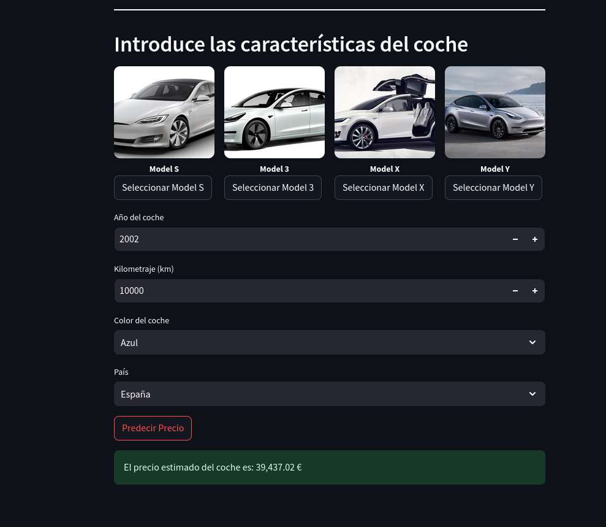
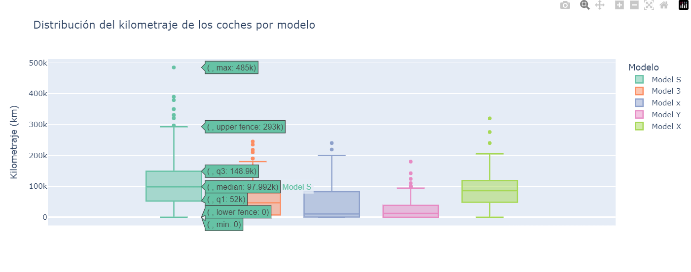
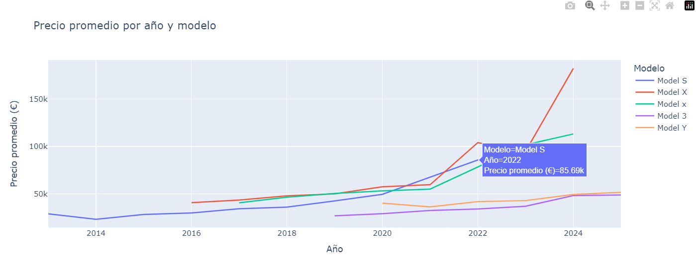
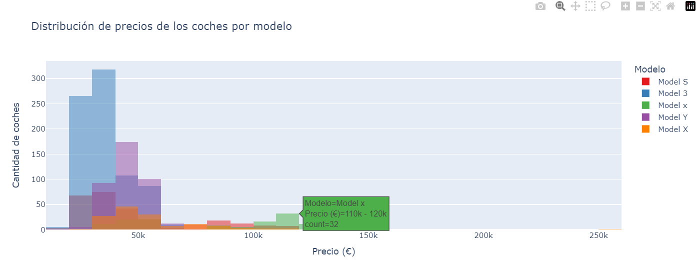

# Tesla Car Price Prediction 🚗

An interactive application developed with **Streamlit** that uses a **Machine Learning** model to predict the price of Tesla cars (Model S, Model 3, Model X, and Model Y) based on data collected from various sources through web scraping techniques.

---

## Screenshot

The main interface of the application:



---

## Project Description

This project aims to provide an intuitive tool that allows users to estimate the price of a Tesla car based on its characteristics.

### Project Workflow:
1. **Data Collection:**
   - Data was collected from specialized car sales websites through **web scraping**:
     - [Coches.net](https://www.coches.net)
     - [Tesla.com](https://www.tesla.com)
     - [TeslaHunt.io](https://www.teslahunt.io)
     - [Autoscout24.es](https://www.autoscout24.es/)

2. **Data Processing:**
   - The data was cleaned and processed in a controlled environment.
   - Categorical variables such as model, color, and country were encoded using **LabelEncoder**.
   - Mileage was normalized using a scaler (**MinMaxScaler**).

3. **Model Training:**
   - A **Random Forest** model was used due to its robustness, ability to handle tabular data, and excellent performance with nonlinear relationships.
   - The model was trained using the following features:
     - Car model (Model S, Model 3, Model X, Model Y).
     - Manufacturing year.
     - Mileage.
     - Color.
     - Country.

4. **Streamlit Implementation:**
   - The application allows users to select the car's features through an intuitive graphical interface.
   - It uses serialized files in **pickle** format to load the trained model and preprocessing objects (scaler and encoders).

---

## Project Structure

```
PREDICT_TESLA_PRICE/
├── assets/                             # Visual resources (images, screenshots)
│   ├── streamlit_img.png               # Image of the Streamlit interface
├── data/                               # Folder containing obtained and processed data
│   ├── data.ipynb                      # Notebook for data exploration
│   ├── datos.csv                       # Combined data for training
│   ├── df_tesla_final.csv              # Final scraped data
│   ├── tesla_coches_combinados.csv     # Tesla car data
├── webscrapping/                       # Scripts to extract data from the web
|   ├── autoscout24.ipynb               # Web scraping from AutoScout24.es
│   ├── coches_net.ipynb                # Web scraping from Coches.net
│   ├── df_teslas.csv                   # Extracted data from scraping
│   ├── tesla_autoscout24.csv           # Extracted data from scraping AutoScout24
│   ├── tesla_page.ipynb                # Web scraping from Tesla.com
├── .gitignore                          # Files and folders to ignore in Git
├── 20241128_Proyecto_Tesla.pdf         # Project-related document
├── app.py                              # Main Streamlit application code
├── tesla_price_prediction_env.yml      # Conda virtual environment file
├── README.md                           # Project documentation
├── train_model.ipynb                   # Notebook for model training
```

---

## Installation

Follow these steps to run the application locally:

1. **Clone this repository:**
   ```bash
   git clone https://github.com/your_username/predict_tesla_price.git
   ```

2. **Navigate to the project directory:**
   ```bash
   cd predict_tesla_price
   ```

3. **Install the dependencies:**
   Ensure you have a virtual environment and run:
   ```bash
   conda env create -f tesla_price_prediction_env.yml
   conda activate tesla_price_prediction_env
   ```

4. **Run the Streamlit application:**
   ```bash
   streamlit run app.py
   ```

---

### **EDA and Data Cleaning**

During the exploratory data analysis (EDA) and data cleaning phase, we encountered several challenges that required careful handling to ensure a clean and consistent dataset for model training:

1. **Inconsistent Model Names:**
   - One of the main issues was the inconsistency in how car models were named across the sources. For example:
     - Some entries simply listed the model as **Model 3**, while others used the full name, such as **Tesla Model Y Long Range AWD**.
   - To address this, we standardized the model names by extracting the relevant portion (e.g., "Model S," "Model 3," "Model X," "Model Y") and mapping them to a consistent format.

2. **Mileage Format Variations:**
   - Mileage data was another challenge, as it was represented inconsistently:
     - In some datasets, mileage was a numerical value.
     - In others, it was stored as text and included the unit, such as **"12,000 km"** or **"45.000 km"**.
   - We addressed this by:
     - Removing the unit (`km`) and commas or dots used as thousand separators.
     - Converting the cleaned text into numerical format for analysis and normalization.

3. **Missing or Incorrect Data:**
   - Some entries contained missing values or obviously incorrect data (e.g., a car model with 0 kilometers but a high price).
   - To handle this:
     - Missing or erroneous rows were removed if they couldn't be reasonably inferred or filled.
     - For critical features like mileage or manufacturing year, we imputed missing values where possible using median values or similar entries.

4. **Encoding Categorical Features:**
   - To make the data usable for the machine learning model, categorical variables such as **color**, **country**, and **model** were encoded using **LabelEncoder**.
   - This ensured that all features were in a numerical format compatible with the model.

5. **Normalization:**
   - Since features like mileage and manufacturing year were on different scales, we normalized these numerical values using **MinMaxScaler** to improve model performance.

By addressing these challenges, we prepared a clean and reliable dataset that was well-suited for training the machine learning model. The steps and transformations applied are documented in the `data.ipynb` notebook for reference and reproducibility.

### **Graph Analysis**

1. **Mileage Distribution by Car Model**
   
   - The boxplot shows a wide variability in the mileage of different models.

   - Model S has a very broad range of mileage, with values reaching up to 485,000 km, while Model 3 and Model Y have significantly lower mileage on average.

   - Outliers can be observed in models with higher mileage, suggesting the presence of heavily used vehicles in the dataset.

   - This graph is useful for identifying models with higher wear and indicates that some models are used more intensively than others.

2. **Average Price by Year and Model**
   
   - The line chart reveals an upward trend in the average price of vehicles in recent years, especially notable for newer models like Model S and Model X.

   - The price increase from 2020 onwards may be related to the introduction of new versions or significant technological improvements.

   - Models like Model 3 show more stable prices over time, possibly because they remain more affordable options within the range.

   - This chart is key to understanding the evolution of vehicle values over time.

3. **Price Distribution by Car Model**
   
   - The histogram indicates that most vehicles are concentrated in the price range between 30,000 and 80,000 euros, especially for Model S and Model 3.

   - A lower frequency of vehicles with prices above 100,000 euros is observed, likely corresponding to luxury versions or special editions.

   - This visualization is useful for identifying the most common price range and could help buyers set realistic expectations about vehicle costs.

4. **Relationship Between Price and Mileage by Model**
   
   - The scatter plot shows an inverse relationship between price and mileage; vehicles with higher mileage tend to have lower prices.

   - There is a notable concentration of vehicles with low mileage and high prices, which could indicate newer or better-maintained vehicles.

   - Models like Model X and Model Y appear to maintain high prices even with higher mileage, which may indicate a higher perceived value or better market retention.

   - This graph is valuable for assessing how vehicle usage affects its market value.

## Functionality

### **1. Web Scraping**
The input data was obtained using web scraping scripts located in the `webscrapping` folder. These scripts collect data from the following sites:
- **Coches.net**: Tesla cars for sale.
- **Tesla.com**: Official information about base prices.
- **TeslaHunt.com**: Listings of second-hand Tesla cars.
- **Autoscout24**: Tesla car prices in different countries.

### **2. Model Training**
The prediction model was trained with combined and preprocessed data in the `train_model.ipynb` file. The features used include:
- **Car model**: Model S, Model 3, Model X, Model Y.
- **Year**: Manufacturing year of the car.
- **Mileage**: Distance traveled in kilometers.
- **Color**: Car color.
- **Country**: Location of the car.

### **3. Interactive Interface**
The interface allows the user to:
- Select the car model (with images).
- Input features such as year, mileage, color, and country.
- Obtain a price prediction based on the trained model.

The application also displays the model's accuracy (R² Score).

---

## Features

- **Accurate Prediction:** Based on real data from multiple sources.
- **Intuitive Interface:** Clear visualization of available options.
- **Extensibility:** Easy to expand with new data or features.

---
